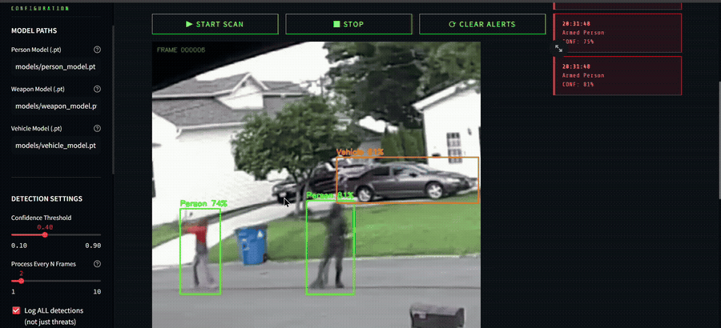
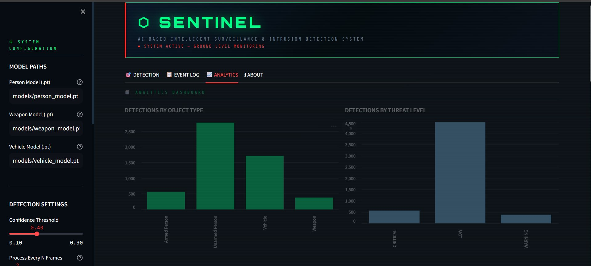
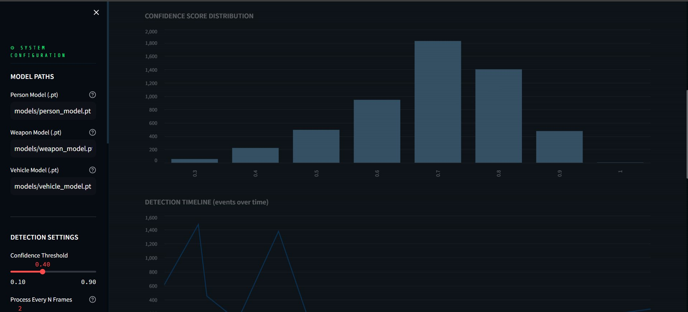
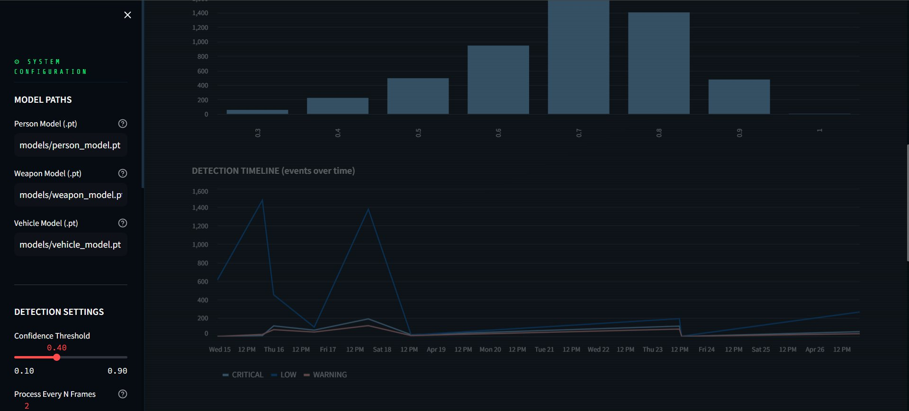
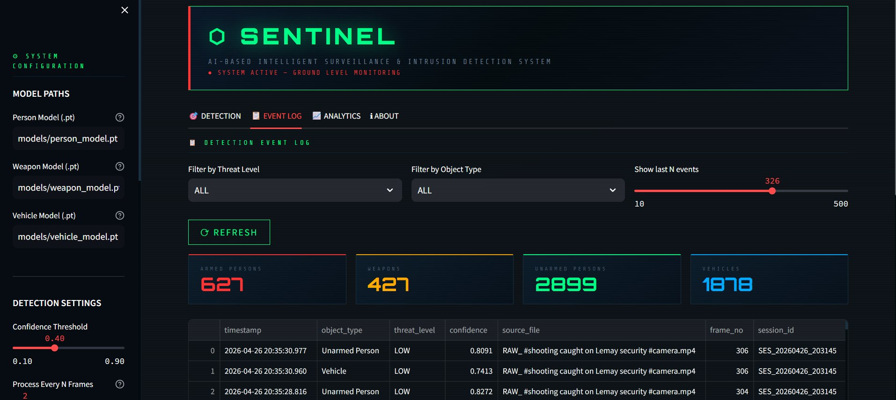
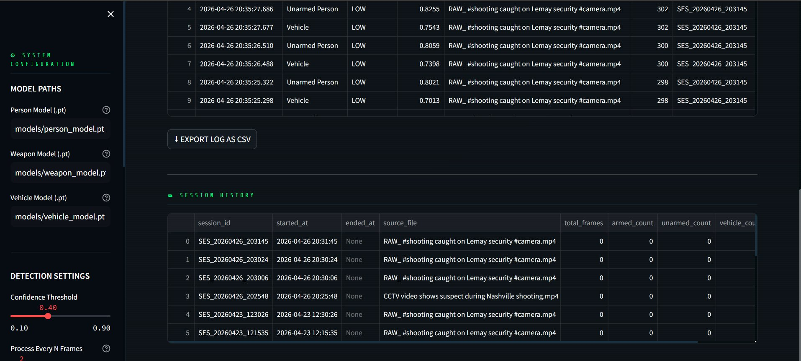

# 🛡️ SENTINEL — AI-Powered Surveillance & Intrusion Detection System

> *Can CCTV systems do more than just record footage?*  
> SENTINEL is the answer.

SENTINEL is an AI-powered video surveillance system that processes recorded footage using **three custom-trained YOLOv8 models running in parallel** — detecting vehicles, tracking persons with persistent IDs, flagging weapons, and triggering a **CRITICAL alert** the moment an armed individual is detected.

Built as a Semester 6 Minor Project — B.Tech CSE, Punjabi University Patiala.

---

## 🎬 Demo


*Live detection — armed person flagging, persistent tracking IDs, real-time event logging*

---

## 📸 Screenshots

### Dashboard & Event Log

*Live detection event log with threat level filtering, confidence scores, session history, and CSV export*

### Analytics Dashboard

*Detections broken down by object type (Armed Person, Unarmed Person, Vehicle, Weapon) and threat level (CRITICAL, LOW, WARNING)*

### Confidence Score Distribution

*Distribution of model confidence scores across all detections in a session*

### Detection Timeline

*Events plotted over time across multiple sessions, colour-coded by threat level*

### Event Log — Summary Cards

*Real-time counters: 627 Armed Persons · 427 Weapons · 2899 Unarmed Persons · 1878 Vehicles detected*

---

## 🚨 How It Works

### Multi-Model Parallel Inference

SENTINEL runs three specialized YOLOv8 models simultaneously on every frame:

| Model | Task | Training |
|-------|------|----------|
| **Person Model** | Detect & track individuals with persistent IDs | 3 training rounds · CCTV-specific dataset added after 2 failures |
| **Vehicle Model** | Detect vehicles — aerial + ground level | 110+ epochs · VisDrone + Vehicle Detection 2.0 |
| **Weapon Model** | Detect firearms | 60+ epochs · firearms-specific surveillance data |

### Armed Person Detection — No Fourth Model Needed

Most approaches would train a separate classifier for armed vs. unarmed detection. SENTINEL doesn't.

```
Person bounding box  ∩  Weapon bounding box  ≠  ∅
             ↓
         ARMED  →  🔴 CRITICAL ALERT
```

If the bounding boxes spatially overlap, that person is flagged as **ARMED** and an alert fires immediately.  
No extra model. No extra dataset. Just geometry doing its job.

---

## ✨ Features

| Feature | Details |
|---------|---------|
| 🎥 Video upload | Upload any recorded `.mp4` / `.avi` file |
| 🧠 Parallel inference | 3 YOLOv8 models run simultaneously per frame |
| 🔴 CRITICAL alerts | Fires instantly on armed person detection |
| 🪪 Persistent person IDs | Individuals tracked consistently across frames |
| 🗄️ SQLite event logging | Timestamp · threat level · confidence · bounding box coords |
| 📊 Analytics dashboard | Detections by object type, threat level, confidence distribution, timeline |
| 🔍 Filterable event log | Filter by threat level, object type, and number of recent events |
| 📥 CSV export | Download the full event log |
| 🕓 Session history | Full history of past analysis sessions |

---

## 🛠️ Tech Stack

- **Python 3.9+**
- **YOLOv8** — Ultralytics
- **Streamlit** — Dashboard UI
- **OpenCV** — Video frame processing
- **SQLite** — Event logging & session history
- **Roboflow** — Dataset sourcing (8 datasets across 3 models)

---

## 🗂️ Project Structure

```
sentinel/
├── models/
│   ├── person_model.pt
│   ├── weapon_model.pt
│   └── vehicle_model.pt
├── app/
│   ├── main.py            # Streamlit dashboard entry point
│   ├── inference.py       # Parallel YOLOv8 model inference
│   ├── alert.py           # Bounding box overlap → armed person logic
│   └── logger.py          # SQLite event logging
├── database/
│   └── events.db
├── requirements.txt
└── README.md
```

---

## 🚀 Getting Started

### Download Models

The trained model weights are hosted on Google Drive. Download and place them in the `models/` folder.

| Model | Download |
|-------|----------|
| Person Model (`person_model.pt`) | [⬇ Download](https://drive.google.com/file/d/1jX8WjR3HXIf3DQON_rInKgSc6aqa0MU2/view?usp=drive_link) |
| Weapon Model (`weapon_model.pt`) | [⬇ Download](https://drive.google.com/file/d/1zVU5GuPSFjl7w0Uy7KvCiqDufxhTa7PD/view?usp=drive_link) |
| Vehicle Model (`vehicle_model.pt`) | [⬇ Download](https://drive.google.com/file/d/1GaPznM4NScxOv8XJQNXwgsvbwVyuj_Sd/view?usp=drive_link) |

### Prerequisites

- Python 3.9+
- pip
- Downloaded model weights placed in the `models/` folder

### Installation

```bash
# Clone the repository
git clone https://github.com/Manmeetsingh31/sentinel.git
cd sentinel

# Install dependencies
pip install -r requirements.txt
```

### Run the App

```bash
streamlit run app/main.py
```

Open `http://localhost:8501` in your browser. Configure model paths in the sidebar, upload a video, and SENTINEL handles the rest.

### Configure Model Paths

In the sidebar under **System Configuration**, point each field to your model weights:

```
Person Model (.pt)  →  models/person_model.pt
Weapon Model (.pt)  →  models/weapon_model.pt
Vehicle Model (.pt) →  models/vehicle_model.pt
```

Adjust **Confidence Threshold** (default: `0.40`) and **Process Every N Frames** (default: `2`) as needed.

---

## 📦 Datasets Used

| Dataset | Used For |
|---------|----------|
| VisDrone | Aerial vehicle detection |
| Vehicle Detection 2.0 | Ground-level vehicle detection |
| Firearms Surveillance Dataset | Weapon detection |
| CCTV Overhead Person Dataset | Overhead-angle person detection |
| + 4 supplementary datasets | Augmentation across all models |

*8 Roboflow datasets total across all 3 models.*

---

## 🔮 Roadmap — Phase 2

- [ ] Vehicle sub-classification (car, truck, motorcycle, bus, etc.)
- [ ] Number plate OCR
- [ ] Night mode & infrared support
- [ ] Aerial / drone footage detection
- [ ] Edge deployment on Jetson Nano
- [ ] Live RTSP stream support

---

## ⚠️ Training Notes

Each model was trained on **Google Colab free tier** across multiple interrupted sessions.

**The hard lessons:**

- **Person model** — Failed twice. Standard datasets didn't generalize to overhead CCTV camera angles. Had to source a CCTV-specific dataset and retrain from scratch a third time.
- **Vehicle model** — 110+ epochs split across 6 Colab sessions due to runtime crashes and disconnects.
- **Weapon model** — 60+ epochs with periodic checkpoint corruption.

At one point, an entire session vanished — no logs, no notebook cells, nothing. The only survivor was `best.pt` sitting quietly in Google Drive.

**Rules established after that:**
> Mount Drive first. Save every 5 epochs. Trust nothing.

---

## 👤 Author

**Manmeet Singh**  
E-mail    -  manmeetbadhan3104@gmail.com
B.Tech CSE — Semester 6, Punjabi University Patiala

[](https://github.com/Manmeetsingh31)

---

> *"The model isn't the hardest part. Staying alive long enough to finish it is."*
